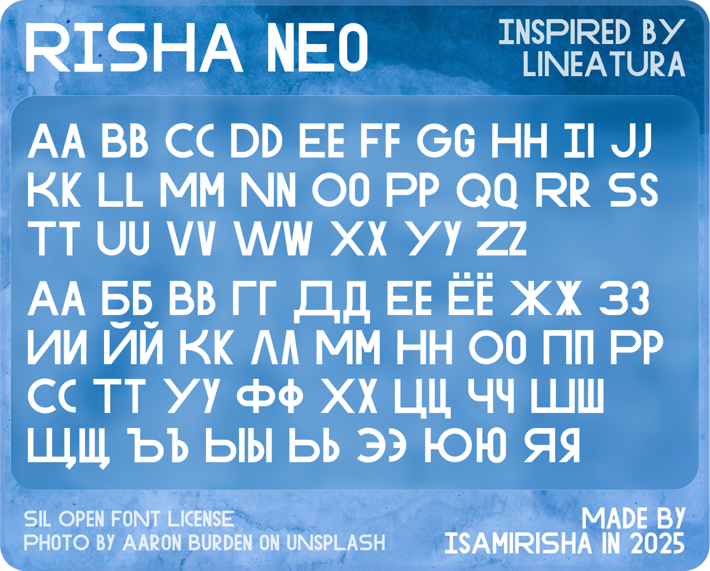

# Risha Neo Font 1.0
Free display font open for everyone to download :)

[](https://github.com/isamirivers/Risha-Neo/tree/main/font)
[](#connect-css)


## Connect CSS
You can easily connect this font to your CSS using the method you prefer:
1. By adding the following code into the `<head>` of your HTML file:
```html
<link rel="stylesheet" href="https://cdn.jsdelivr.net/gh/isamirivers/Risha-Neo@main/stylesheet.css">
```
2. By adding the following code at the start of your CSS file:
```css
@import url('https://cdn.jsdelivr.net/gh/isamirivers/Risha-Neo@main/stylesheet.css');
```
And then simply use this font in any of your CSS selectors. For example:
```css
p {font-family: "Risha Neo", sans-serif}
```

## Thanks
I am very thankful to [rsms](https://github.com/rsms) because I made this font with his script for Figma :)
https://www.figma.com/community/file/1115382696459820988/Making-a-font-in-Figma
